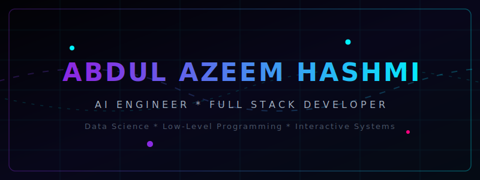

<div align="center">
  

  # 🌟 Abdul Azeem Hashmi | Portfolio 🚀

  [](https://abdulazeemhashmi.vercel.app/)
  [](https://github.com/AbdulAzeemHashmi/Portfolio)

  <h3>🌌 Sleek, Modern, and Interactive Personal Portfolio built with Next.js, React, and Tailwind CSS.</h3>

  ---
</div>

## 🧠 Services & Expertise

* **🧠 AI & Data Science**
  * Building predictive models, exploratory data analysis (EDA), and intelligent systems using Python, Scikit-Learn, and custom AI logic.
  * *Highlight:* Expert in Pandas, NumPy, and Data Pipelines.

* **⚙️ Backend & Database Architecture**
  * Developing robust server-side logic and highly optimized relational/NoSQL databases to power complex web applications seamlessly.
  * *Highlight:* Proficient in SQL, MongoDB, Node.js, and ERD Modeling.

* **🚀 Low-Level & Logic Engineering**
  * Crafting performant, logic-heavy applications, algorithms, and game loops with advanced data structures and memory management.
  * *Highlight:* Comprehensive C++ and Object-Oriented Programming (OOP).

---

## 🛠️ Core Tech Stack

<div align="center">
  <table>
    <tr>
      <td><b>Languages</b></td>
      <td>
        
        
        
        
        
      </td>
    </tr>
    <tr>
      <td><b>Frameworks & UI</b></td>
      <td>
        
        
        
      </td>
    </tr>
    <tr>
      <td><b>Data & AI</b></td>
      <td>
        
        
        
        
      </td>
    </tr>
    <tr>
      <td><b>Databases & Cloud</b></td>
      <td>
        
        
        
      </td>
    </tr>
  </table>
</div>

---

## 🎨 Interactive Portfolio Features

* 🌊 **Dynamic Fluid Particle Canvas**: Interactive, physics-based background particle simulation that reacts to user cursor movements.
* 🎵 **YouTube Audio Pipeline Controller**: Built-in floating music controller that streams background tracks smoothly using the YouTube IFrame API.
* 🌓 **Polished Dark Mode Aesthetics**: Glassmorphic UI containers, glowing borders, custom layout structures, and sleek color palettes.
* 📱 **Fully Responsive Layout**: Built with custom media queries and modern CSS for a seamless desktop, tablet, and mobile user experience.

---

## 📂 Featured Projects

### 🧠 AI & Intelligent Systems

* **🤖 Autonomous Digital Employee**
  * An AI-powered full-stack workstation enabling users to delegate complex tasks to an autonomous digital agent with real-time database logging and Google Gemini primary integration.
  * [GitHub Repo](https://github.com/AbdulAzeemHashmi/autonomous-digital-employee) | [Live Demo](https://autonomous-digital-employee-zeta.vercel.app/)
  * `Next.js` `FastAPI` `LangChain` `Gemini API` `Supabase`

* **🔍 AI Image Verifier**
  * An intelligent image verification system leveraging vision models to analyze, authenticate, and process image content with precision.
  * [GitHub Repo](https://github.com/AbdulAzeemHashmi/AI-Image-Verifier) | [Live Demo](https://ai-image-verifier.vercel.app/)
  * `Next.js` `AI` `Hugging Face` `Supabase` `TypeScript`

* **💬 AI Chatbot**
  * A production-ready full-stack AI Chatbot application featuring a fast Python FastAPI backend and a responsive Next.js frontend, powered by the Google Gemini API.
  * [GitHub Repo](https://github.com/AbdulAzeemHashmi/AI-Chatbot) | [Live Demo](https://ai-chatbot-aah18751.vercel.app/)
  * `Next.js` `FastAPI` `Python` `Gemini API` `TypeScript`

* **📄 AI Resume Analyzer**
  * An intelligent web application that detects resume weaknesses, automatically enhances formatting and content using OpenAI, and provides download options in PDF/DOCX format.
  * [GitHub Repo](https://github.com/AbdulAzeemHashmi/AI-Resume-Analyzer) | [Live Demo](https://ai-resume-analyzer-aah18751.vercel.app/)
  * `TypeScript` `Tailwind CSS` `Python` `Flask` `OpenAI API`

* **✈️ Agentic UAV Mission Planner**
  * An end-to-end mission planning simulator that processes natural language requests, generates optimized waypoint routes, and enforces multi-rule airspace compliance.
  * [GitHub Repo](https://github.com/AbdulAzeemHashmi/agentic-uav-mission-planner)
  * `Python` `Streamlit` `Google Gemini` `Folium` `SQLite`

* **👁️ Artificial Intelligence Open Ended Lab**
  * Open-ended laboratory project focused on building an AI video processing pipeline using object detection, image captioning, and scene impact scoring techniques.
  * [GitHub Repo](https://github.com/AbdulAzeemHashmi/Artificial-Intelligence-Open-Ended-Lab)
  * `Python` `Numpy` `Scikit-Learn` `Matplotlib` `Computer Vision`

* **🚗 RC Car**
  * An intelligent remote-controlled vehicle powered by vision or AI logic models, combining software with automated hardware engineering.
  * [GitHub Repo](https://github.com/AbdulAzeemHashmi/RC-CAR)
  * `ESP32` `C++` `Python` `AI` `Computer Vision`

* **📊 Probability & Statistics Analyzer**
  * Data analysis platform leveraging mathematical and statistical models for predictive analytics and computational insights.
  * [GitHub Repo](https://github.com/AbdulAzeemHashmi/Probability-and-Statistics-Project)
  * `Python` `Pandas` `Matplotlib` `Scikit-Learn` `Statistics`

* **🗃️ Database Systems Open Ended Lab**
  * Open-ended laboratory project exploring vector databases, covering embeddings, similarity search, and indexing for intelligent data retrieval.
  * [GitHub Repo](https://github.com/AbdulAzeemHashmi/Database-Systems-Open-Ended-Lab)
  * `Python` `Pinecone` `Numpy` `Matplotlib` `KNN`

---

### 🌐 Web Development & Databases

* **💻 Personal Portfolio**
  * The source code of this modern, lightning-fast portfolio built with Next.js and Tailwind CSS, fully deployed to Vercel.
  * [GitHub Repo](https://github.com/AbdulAzeemHashmi/Portfolio) | [Live Demo](https://abdulazeemhashmi.vercel.app/)
  * `Next.js` `React` `Tailwind CSS` `TypeScript`

* **🏷️ Support Ticket Management System**
  * A full-stack support ticket management system featuring CRUD dashboards, live statistics, form validation, and persistent SQLite storage.
  * [GitHub Repo](https://github.com/AbdulAzeemHashmi/support-ticket-management-system)
  * `Node.js` `Express` `SQLite` `JavaScript` `HTML/CSS`

* **🎓 Aether Student Portal**
  * Full-stack educational management portal featuring secure user roles, interactive dashboards, and scalable database schemas.
  * [GitHub Repo](https://github.com/AbdulAzeemHashmi/Aether-Student-Portal)
  * `HTML/CSS` `JavaScript` `Node.js` `Backend Design`

* **📞 Assignment & Project Services**
  * A responsive web page offering academic and project services with an instant Price calculator and contact options.
  * [GitHub Repo](https://github.com/AbdulAzeemHashmi/assignment-2-static-webpage) | [Live Demo](https://assignment-2-static-webpage-silk.vercel.app/)
  * `HTML/CSS` `JavaScript` `Vercel` `Responsive Design`

* **🗄️ Database Systems Lab Project**
  * Dynamic web application integrating front-end user interfaces with fully optimized relational MySQL databases.
  * [GitHub Repo](https://github.com/AbdulAzeemHashmi/Database-Systems-Lab-Project)
  * `Web App` `MySQL` `Relational Mapping`

---

### 🎮 Game Development & Console Systems

* **🚥 Rush Hour Game**
  * A logic-heavy strategic puzzle game built with algorithmic board state validations and optimized state evaluation.
  * [GitHub Repo](https://github.com/AbdulAzeemHashmi/Rush-Hour-Game)
  * `C++` `Data Structures` `Game Loop`

* **💥 Word Shooter Game**
  * Fast-paced interactive console application with dynamic collision handling, scoring algorithms, and clean asset execution.
  * [GitHub Repo](https://github.com/AbdulAzeemHashmi/Word-Shooter-Game)
  * `C++` `OOP` `Arcade Architecture`

* **🐍 Snake Game**
  * Pure C++ logic implementation of the classical snake game incorporating dynamic arrays and precise console rendering.
  * [GitHub Repo](https://github.com/AbdulAzeemHashmi/Snake-Game)
  * `C++` `Data Structures` `Memory Management`

---

### 📊 Database Analysis

* **🚨 911 Emergency Data Analysis**
  * Exploratory analysis on massive datasets of 911 emergency calls utilizing document schemas inside MongoDB.
  * [GitHub Repo](https://github.com/AbdulAzeemHashmi/911-Emergency-Analysis-Mongo-DB)
  * `MongoDB` `NoSQL` `Data Cleaning` `JSON Schemas`

* **📸 Instagram Lifestyle DB Analysis**
  * Complex relational model analyzing user actions, trends, and lifecycle data metrics inside modern social database frameworks.
  * [GitHub Repo](https://github.com/AbdulAzeemHashmi/Instagram-Lifestyle-DB-Analysis)
  * `MySQL` `Relational Schema` `Complex Queries`

---

## 🛠️ Project Structure

```
Portfolio/
├── app/          # Next.js App Router pages and layouts
├── public/       # Static assets (images, animated banner, icons)
├── .gitignore
├── eslint.config.mjs
├── next.config.ts
├── package.json
├── postcss.config.mjs
└── tsconfig.json
```

---

## 🚀 Running Locally

### 1. Prerequisites

Make sure you have **Node.js** installed on your system.

### 2. Installation

Clone the repository and install dependencies:

```bash
git clone https://github.com/AbdulAzeemHashmi/Portfolio.git
cd Portfolio
npm install
```

### 3. Run Development Server

```bash
npm run dev
```

Open [http://localhost:3000](http://localhost:3000) in your browser to view the site.

---

## ⚙️ Available Scripts

* `npm run dev`: Start the development server with hot-reloading
* `npm run build`: Build the application for production
* `npm run start`: Run the compiled production build
* `npm run lint`: Run ESLint checks to verify code health

---

## 🌐 Deployment

This portfolio is automatically deployed on [Vercel](https://vercel.com). Every commit pushed to the `main` branch triggers an automated build.

---

## 📬 Contact & Connect

Feel free to connect or reach out:

* 🌐 **Live Portfolio:** [abdulazeemhashmi.vercel.app](https://abdulazeemhashmi.vercel.app/)
* 💻 **GitHub Profile:** [@AbdulAzeemHashmi](https://github.com/AbdulAzeemHashmi)
